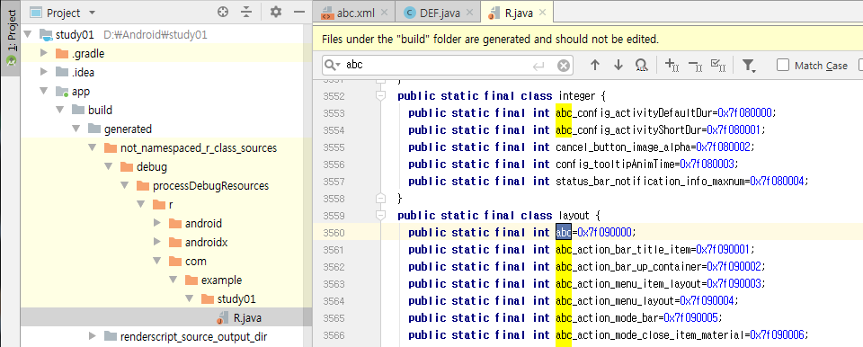

## R.java란?

결론부터 얘기하면 R.java는 상수의 집합체라고 할 수 있다. 빠른 이해를 위해 실제적 예를 바로 살펴보는 것이 좋겠다.

[지난 포스팅](./connect_java_xml.md)에서 `setContentView(R.layout.abc);` 라는 한 줄의 코드가 등장했다. 이는 .java 파일과 abc.xml을 연결시켜주는 코드로 우리는 이해를 했다. 주목해야할 것은 `R.layout.abc`인데 한번 내부로 깊이 들어가보자.

R.java 파일의 위치는 다음과 같다.  
**Project View → app → build → generated → r → 패키지 → R.java (너무 꽁꽁 숨겨놨..)**

R.java 파일은
1. 프로젝트 빌드 실행 시
2. 프로젝트 클린 실행 시
3. 레이아웃의 .xml을 수정 후 정장 했을 시 등등

자동 생성(auto-generated)되는 클래스이다. 즉, 3번에 의해서 abc.xml 이라는 파일이 생성되는 즉시

1. R.java →
2. public final class R {}
3. `public static final class layout {}` →
4. `public static final int abc=0x7f0900000;`

코드가  안에 자동으로 추가되는 것이다.

이 상수는 static으로 선언되어 있기 때문에, 우리는 언제든 필요할 때마다 R.java 클래스를 참조하여 선언된 상수를 끌어다 사용할 수 있다.

.xml 파일생성 이외에도 .xml 내부에서 컴포넌트의 id 값을 추가함으로 R.java 파일의 변화가 생기기도 하는데 [다음 포스팅](./use_components)을 통해서 한 가지 예를 더 살펴보자.
