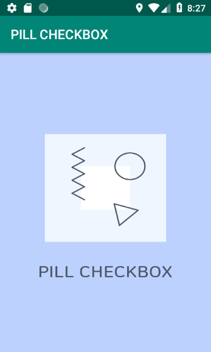
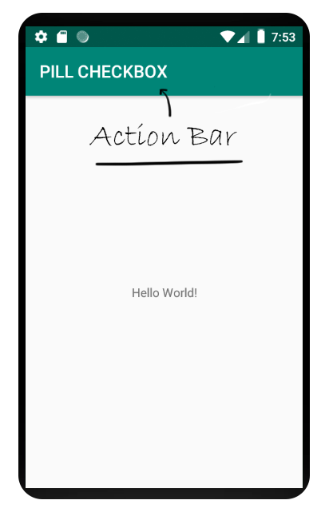
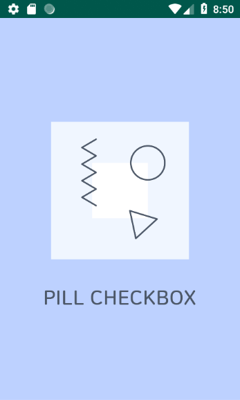

## 안드로이드 액션바 감추기!
앱에 인트로를 추가하고 싶어서 디자인 시안을 가져와 액티비티에 추가해보았다.



..... 예쁘지 않다. 뭔가 찝찝하고 눈에 거슬린다. 저 찝찝하게 생긴 청록색 박스를 치우고 싶은 욕망이 올라온다.

저 찝찝하게 생긴 청록색 박스가 바로 **액션바**이다.



액션바를 없애는 방법은 생각보다 간단하다.

```java
protected void onCreate(Bundle savedInstanceState) {
  super.onCreate(savedInstanceState);
  setContentView(R.layout.activity_intro);

  ActionBar actionBar = getSupportActionBar();
  actionBar.hide();
}
```

단순히 onCreate() 메소드 안에 *코드 두 줄만* 추가해주면 끝!
액션바의 권한을 받아서 .hide() 메소드로 숨겨주는 원리이다.

이렇게 두 줄을 추가해주면



위와 같이 깔끔한 디자인의 인트로 화면이 탄생한다.
