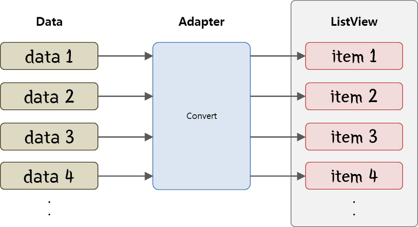
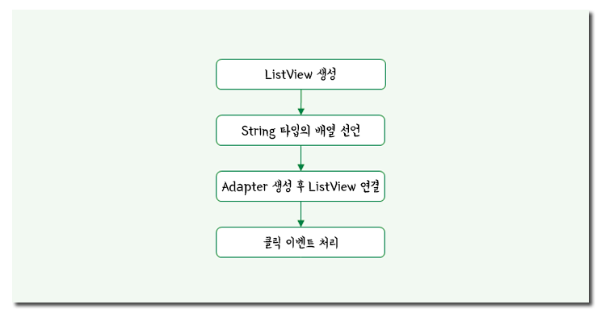

## Android ListView

#### 1. 리스트뷰의 이해
ListView는 사용자가 정의한 데이터 목록을 아이템 단위로 구성하여 화면에 출력하는 ViewGroup의 한 종류이다.

ListView에 표시되는 아이템은 단순히 Text만 출력하는 구조가 될 수 있고, Image, Button, CheckBox 등 여러 View의 조합으로 구성되는 좀 더 복잡한 형태(Custom)가 될 수도 있다.

ListView는 UI를 구성함에 있어 가장 많이 사용되는 컴포넌트 중 하나이며 안드로이드 시스템의 연락처, 환경설정 등이 ListView의 대표적인 예이다.

> 참고 : 안드로이드 View와 ViewGroup
>> 안드로이드에서 UI 화면은 View와 ViewGroup을 사용하여 구성된다.
>>
>> View는 사용자에게 어떤 내용을 보여주거나 입력을 받아들이기 위해 화면에 그려지는 기본 객체를 말한다. TextView, ImageView, Button, CheckBox 등이 대표적이다.
>>
>> 반면에 ViewGroup은 이름 그대로 View들이 모인 Group을 말한다. 즉, 화면에 표시할 하나 이상의 View를 포함하는 컨테이너 역할을 수행하는 것이다. Layout, ListView 등이 ViewGroup에 속하며 View 뿐 아니라 ViewGroup 또한 포함할 수 있다.
>>
>> ListView는 ViewGroup에 속한다. 즉, 데이터를 화면에 표시하기 위해서는 View(또는 ViewGroup)객체가 ListView에 추가되어야 하며, 하나의 View(또는 ViewGroup)는 하나의 아이템 정보를 표시하게 된다.

#### 1.1 Adapter의 이해
ListView에 데이터를 추가하여 화면에 표시하기 위해서는 반드시 Adapter를 사용해야 한다.

> 일반적으로 "어댑터"라는 의미는 "장치 또는 기계의 다른 부분을 연결하는 장치로, 적합하지 않은 두 개의 부분을 전기적 또는 기계적으로 접속하기 위한 장치 또는 도구"를 말한다.

ListView에서 사용하는 Adapter 또한 의미적으로 크게 다르지 않다. 유사한 문장으로 표현하자면 "Data와 View 둘 사이를 이어주는 객체"정도가 되겠다. 즉, Adapter가 하는 역할은 Data를 입력받아 View를 생성하는 것이며 Adapter에서 생성되는 View는 ListView 내 하나의 아이템 영역에 표시되는 것이다.



#### 2. ListView 기본 사용법
안드로이드에서 **기본적으로 제공하는 ListView**는 문자열을 출력하기 위해 사용하는 **TextView만을 포함하는 단순한 구조**를 가지고 있다.

물론 문자열 목록을 출력하는 기본적인 ListView만으로도 충분히 훌륭한 기능을 가진 앱을 만들 수 있지만 좀 더 편리하고 아름다운 UI 제공을 위해 기본 **ListView를 확장**하여 일반적인 UI 화면에 사용하는 컴포넌트들을 그대로 사용하여 구성할 수 있다. 즉, **TextView, ImageView, Button 등을 마음대로 배치하여 ListView의 내용을 구성**할 수 있다.

하지만 다양한 컴포넌트들로 구성된 ListView를 만들기 위해서는 조금 번거로운 작업을 해줘야 한다.

ListView 아이템에 대한 1) Layout을 구성해야 하고, 2) Layout에 출력될 데이터에 대한 새로운 클래스를 정의해야 하며, 3) 사용자 데이터를 Layout에 정의된 형태의 View로 변환하기 위한 Adapter 클래스도 상속받아 필요한 함수를 채워줘야 한다.

이렇게 기본 ListView로부터 확장된 기능을 가지는 ListView를 CustomView라고 말하는데, 이에 대한 내용은 [추후 포스팅]()에서 자세히 정리하자.

우선은 ListView 사용법에 대한 이해를 위해 기본 ListView에 대한 작업 절차를 진행하자.

#### 2.1 workflow


#### 2.2 ListView 생성
ListView를 어디에 위치할 것인지를 결정한 후에 .xml을 작성한다.
```xml
activity_main.xml
<?xml version="1.0" encoding="UTF-8"?>
<LinearLayout
  xmlns:android="http://schemas.android.com/apk/res/android"
  xmlns:app="http://schemas.android/com/akp/res-auto"
  xmlns:tools="http://schemas.android.com/tools"
  android:layout_width="match_parent"
  android:layout_height="match_parent"
  android:orientation="vertical"
  tools:context=".MainActivity"
  >

  <ListView
    android:id="@+id/listview"
    android:layout_width="match_parent"
    android:layout_height="match_parent">

  </ListView>

</LinearLayout>
```

#### 2.3 String 타입의 배열 선언
```java
public class MainActivity extends AppCompatActivity {

  // 1.
  static final String[] list = {"apple", "banana", "mango"};

  // 2.
  static final List<String> list = new ArrayList<>();
  list.add("apple");
  list.add("banana");
  list.add("mango");
}
```

#### 2.4 Adapter 생성 후 ListView에 연결
```java
public class MainActivity extends AppCompatActivity {
  // 1.
  static final String[] list = {"apple", "banana", "mango"};

  // 2.
  static final List<String> list = new ArrayList<>();
  list.add("apple");
  list.add("banana");
  list.add("mango");

  @Override
  protected void onCreate(Bundle savedInstanceState) {
    super.onCreate(savedInstanceState);
    setContentView(R.layout.activity_main);

    ArrayAdapter adapter = new ArrayAdapter(this, R.layout.simple_list_item_1, list);

    ListView listview = (ListView)findViewById(R.id.listview);
    listview.setAdapter(adapter);
  }
}
```

> `ArrayAdapter(Context context, int resource, T[] objects)`
> - `context` : 액티비티 인스턴스
> - `resource` : 정의되어있는 layout 파일의 resource ID
> - `obejcts` : ListView 아이템으로 나타날 데이터가 저장되어 있는 배열 객체(`String[]`, `ArrayList<String>`)

#### 2.5 클릭 이벤트 처리
ListView 각각의 아이템이 사용자의 터치 입력을 받을 수 있도록 ListView에 `OnItemClickListener`를 연결 해준다(set 해준다).
```java
listview.setOnItemClickListener(new AdapterView.OnItemClickListener() {

  @Override
  public void onItemClick(AdapterView parent, View v, int position, long id) {

    // get TextView's Text
    String strText = (String)parent.getItemAtPosition(position);

    // TODO : use strText ...
  }
})
```
