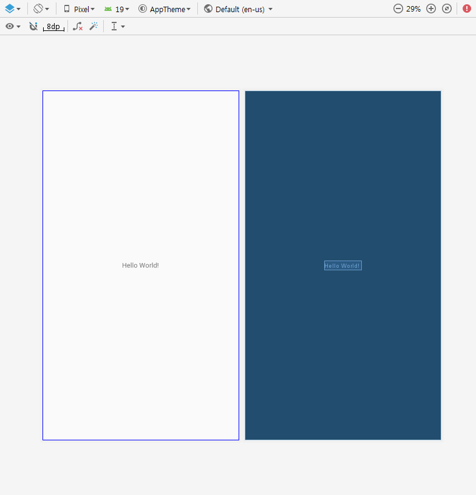
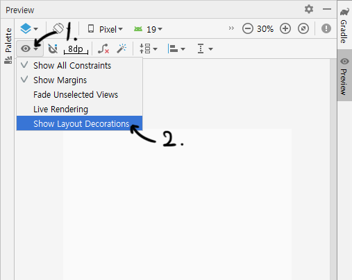
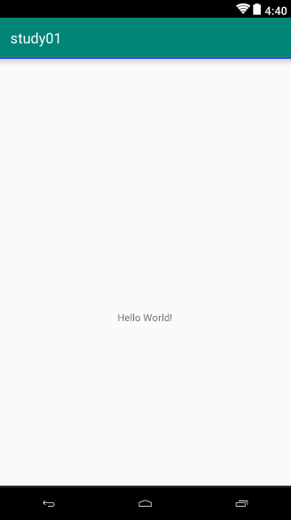

## 안드로이드 프리뷰에서 액션바 on/off 하기

안드로이드 스튜디오를 실행시켜서 처음 .xml을 켜고 프리뷰 화면을 확인했는데 액션바가 없다?!

  

이 문제는 쉽게 해결할 수 있다!

  1. 프리뷰 화면 좌측 상단에 눈 모양 아이콘을 누른 후에
  2. 'Show Layout Decorations'을 누른다

  

이렇게 하면 아래와 같이 액션바를 프리뷰에서 볼 수 있다!

