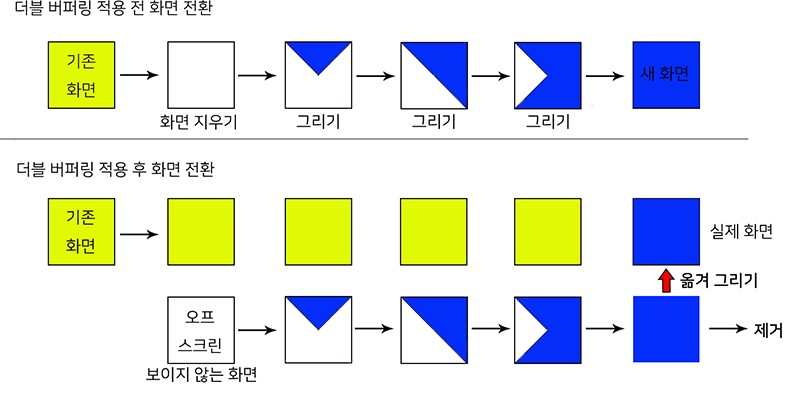

# java - GUI

### # 01 drawImage(); 사용법
화면에 이미지를 그리기 위해서는 다음과 같은 과정이 필요하다.

  1. 화면에 구현하고 싶은 이미지가 필요
  2. 원하는 화면 사이즈 만큼의 이미지 객체 생성
  3. 생성된 이미지 객체를 그래픽 객체로 연결

자바에서 그림이 그려지는 과정은 **이미지 객체** 위에서 일어나는 것이 아니라 **그래픽 객체** 위에서 일어나기 때문에 반드시 화면 사이즈 만큼의 이미지 객체와 그래픽 객체를 연결시키는 과정이 필요하다.

아래의 메소드와 생성자를 통한 고찰은 이러하다.

 1. Graphics 객체 위에 drawImage() 하기 위해서 drawImage() 메소드의 파라미터인 Image 객체가 필요하다.
 2. 내가 화면에 구현하고 싶은 이미지를 객체로 등록하기 위해서 URL 추적이 가능한 ImageIcon 생성자를 활용한다.
 3. 마지막으로 ImageIcon 클래스에서 제공하는 getImage() 메소드를 사용하여 ImageIcon에서 Image로 데이터 타입을 변환한다.

## 1. drawImage();
> Class : Object > Graphics <br>
> Abstract Method : drawImage(Image, int, int, ImageObserver) <br>
> Return : boolean

## 2. ImageIcon() {}
> Class : Object > ImageIcon <br>
> Constructor : ImageIcon(URL)

## 3. getImage();
> Class : Object > ImageIcon <br>
> Method : getImage() <br>
> Return : Image

```Java
private Image screenImage;
private Graphics screenGraphic;

private Image background = new ImageIcon(Main.class.getResource("../images/introBackground(Title).jpg")).getImage();

public void paint(Graphics g) {
  screenImage = createImage(Main.SCREEN_WIDTH, Main.SCREEN_HEIGHT);
  screenGraphic = screenImage.getGraphics();
  screenDraw(screenGraphic);
  g.drawImage(screenImage, 0, 0, null);
}

public void screenDraw(Graphics g) {
  g.drawImage(background, 0, 0, null);
  this.repaint();
}
```
1. drawImage()는 Image 객체를 매개변수로 받아서 화면에 이미지를 그린다.
2. URL을 통하여 이미지를 등록할 때에는 ImageIcon 생성자를 이용한다. <br>
`ImageIcon(Main.class.getResource("../images/introBackground(Title).jpg"))`
3. ImageIcon을 Image로 변환할 때 getImage()를 사용한다. <br>
`.getImage();`

### # 02 더블 버퍼링(Double Buffering)
> "이중 버퍼링이라 불리기도 하며, 그래픽 객체에 이미지를 그릴 때 사용되는 기법이다."

Q) 왜 사용하는가?

A) 게임 캐릭터 이미지를 구현할 때 이미지를 움직이게 하고 싶다. 그러나 캐릭터가 띄엄띄엄 움직임과 동시에 깜빡거리는 화면 때문에 게임할 맛이 안난다.

**이러한 현상이 나타나는 이유**는 `컴퓨터가 이미지를 지웠다가 새 이미지를 다시 그리는 방식을 반복하기 때문이다.` 즉, 이미지를 그리는 데 시간이 소요되므로 이미지의 출력이 잦으면 깜빡거리는 현상이 심해진다.

**이에 대한 해결방안**으로 버퍼 역할을 해줄 메모리 장치 컨텍스트(오프 스크린)를 하나 더 사용하여 그곳에 이미지를 그리고, 기존 화면은 유지하다가 오프 스크린에 이미지가 완성되면 실제 화면 장치 컨텍스트로 한꺼번에 베껴 그리는 것이다.

아래는 이를 그림으로 표현한 것이다.



Q) 어떻게 사용하는가?

A)
```java
// Fields
Image buffImage; // 버퍼링용 이미지
Graphics buffGraphic; // 버퍼링용 그래픽

// Constructor
Exp {
  repaint(); // repaint() >> update(g) >> paint(g) 순서로 메소드 호출
}

// Methods
public void paint(Graphics g) {
  if(buffGraphic == null) {
    // 1. 버퍼링용 이미지 생성
    buffImages = createImage(이미지 넓이, 이미지 높이); // 1

    if(buffImage == null) {
      System.out.println("더블 버퍼링용 오프 스크린 생성 실패");
    } else {
      /* 2. 이미지를 생성해도 그래픽 객체를 얻어야
            이미지 위에 그리고자 하는 것을 그릴 수 있다. */

      buffGraphic = buffImage.getGraphics(); // 2
    }
  }

  update(g); // 이렇게하면 반복적인 메소드 실행이 가능하다.
}

public void update(Graphics g) {
  // 3. 버퍼링용 그래픽에 이미지 객체를 그린다.
  buffGraphic.drawImage(이미지 객체, 0, 0, this); // 3

  /* 4. 실제 화면(g)으로 오프 스크린(BuffGraphic)에
        그려진 이미지(buffImage)를 옮긴다. */

  g.drawImage(buffImage, 0, 0, this); // 4
}
```
1. 버퍼링용 이미지 생성
2. 버퍼링용 그래픽 생성
3. 그래픽에 원하는 이미지 객체를 그린다.
4. 실제 화면으로 오프 스크린에 그려진 이미지를 옮긴다.
5. update(g) >> paint(g) : infinity roof

### # 03 커스텀 버튼 등록하기
화면에 내가 원하는 이미지의 버튼을 등록하기 위해서는 다음과 같은 과정이 필요하다.

  1. ImageIcon 객체에 이미지 등록
  2. JButton 객체에 ImageIcon 등록
  3. 버튼에 대한 기본 설정 제거
  4. 마우스 이벤트 구현
  5. 등록된 버튼을 화면에 그리기

```Java
private ImageIcon startButtonIn = new ImageIcon(Main.class.getResource("../images/startButtonIn"));
private ImageIcon startButtonOut = new ImageIcon(Main.class.getResource("../images/startButtonOut"));

private JButton startButton = new JButton(startButtonOut);

startButton.setBounds(820, 450, 400, 100);
startButton.setBorderPainted(false);
startButton.setContentAreaFilled(false);
startButton.setFocusPainted(false);
startButton.addMouseListener(new MouseAdapter() {
  @Override
  public void mouseEntered(MouseEvent e) {
  	startButton.setIcon(startButtonEnteredImage);
  	startButton.setCursor(new Cursor(Cursor.HAND_CURSOR));
  }
  @Override
  public void mouseExited(MouseEvent e) {
  	startButton.setIcon(startButtonBasicImage);
  	startButton.setCursor(new Cursor(Cursor.DEFAULT_CURSOR));
  }
  @Override
  public void mousePressed(MouseEvent e) {
  	// 시작 이벤트 구현
  }
});
add(startButton);

public void paint(Graphics g) {
  screenImage = createImage(Main.SCREEN_WIDTH, Main.SCREEN_HEIGHT);
  screenGraphic = screenImage.getGraphics();
  screnDraw(screenGraphic);
  g.drawImage(screenImage, 0, 0, null);
}

public void screenDraw(Graphics g) {
  paintComponents(g);
  this.repaint();
}
```
