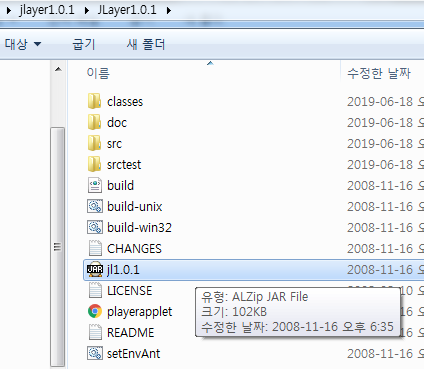
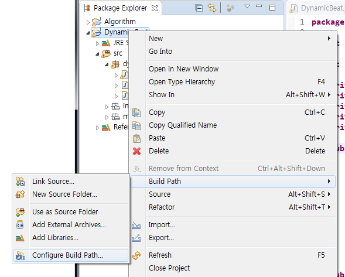
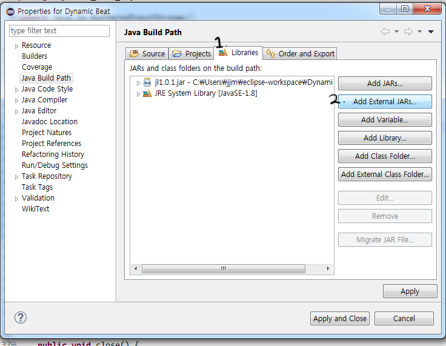

# java - mp3 재생하기

### # 01 mp3 파일 준비
mp3를 재생하기 위해선 당연히 mp3 파일이 있어야 한다.

  1. music 이라는 이름의 하위 디렉토리를 생성한 후
  2. 준비된 mp3 파일을 music 디렉토리에 넣어준다.
  3. 파일 이름은 **introMusic.mp3** 이라고 가정하자.

### # 02 자바 라이브러리(JLayer) 준비
mp3을 실행하기 위해서는 자바 라이브러리가 필요하다. 대표적인 mp3 파일 실행 라이브러리로 JLayer를 사용한다.

  1. [javazoom 사이트 접속](http://www.javazoom.net/index.shtml)
  2. [JLayer 다운로드](http://www.javazoom.net/javalayer/sources.html)
  3. 다운로드 받은 파일 압축 해제
  4. Jl1.0.1 파일을 프로젝트 디렉토리로 복사 <br>
   <br>
  5. Build path → Configure Build Path →  Libraries → Add External JARs <br>
   <br>
  6. 외부 라이브러리 Jl1.0.1 추가 <br>
  

### # 03 Music 클래스 생성 후 Thread 상속 받기

```java
import java.io.BufferedInputStream;
import java.io.File;
import java.io.FileInputStream;

import javazoom.jl.player.Player;

public class Music extends Thread {

  private Player player;
  private boolean isLoop; // 곡이 무한 반복인지, 1회 재생인지를 설정

  private File file;
  private FileInputStream fis;
  private BufferedInputStream bis;

  // 생성자
  public Music(String name, boolean isLoop) {
    try {
      this.isLoop = isLoop;
      file = new File(Main.class.getResource("../music/" + name).toURI());
      fis = new FileInputStream(file);
      bis = new BufferedInputStream(fis);
      player = new Player(bis);
    } catch (Exception e) {
      System.out.println(e.getMessage());
    }
  }

  public void close() {
    isLoop = false;
    player.close();
    this.interrupte(); // 쓰레드를 중지 상태로 만든다.
  }

  @Override
  public void run() { // 쓰레드를 상속받으면 무조건 오버라이드 해야한다.
    try {
      do {
        player.play();
        fis = new FileInputStream(file);
        bis = new BufferedInputStream(fis);
        player = new Player(bis);
      } while (isLoop); // 무한 반복 설정에 따라 재생
    } catch (Exception e) {
      System.out.println(e.getMessage());
    }
  }
}
```

### # 04 Main 클래스에서 Music 클래스 사용하기

```java
public class Main {

  public static void main(String[] args) {
    // introMusic.mp3 파일을 무한 반복 재생한다.
    Music playMusic = new Music("introMusic.mp3", true);
    playMusic.start();
  }

}
```
